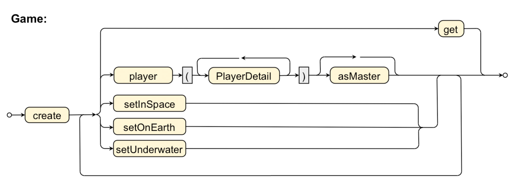
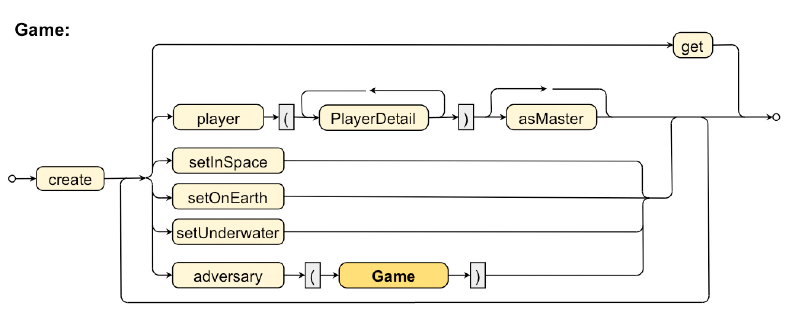

# Lab Unit "Fluent Interfaces"

The purpose of this lab is to develop an API implementing a "domain specific language" (DSL) for a hypothetical game that is to be set up using Java code.
This game needs player objects, master-player details, and location information that will be "collected" via a DSL before creating a `Game` object.

This repository contains the sourcecode to the four different grammar levels: **Basic**, **Nested**, **RandomOrder**, and **Recursive**.

Each solution is accessible here as a package representing the grammar level.
Each solution is tested in corresponding Unit test;
## Grammar diagrams
### Basic Grammar:

### Nested Methods Grammar:

### Random Order Grammar:

### Recursive Grammar:

