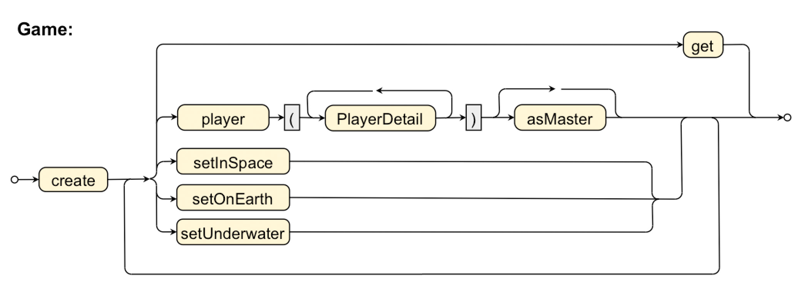

# "RandomOrder" Grammar

The grammar slightly changed again. Now the order of verbs is no longer restricted. `Location`s can be set before and after adding players. Note that our DSL got a terminal verb (method `get()`) in order to return a "finished" object of type `Game`.
Setting to different `Location`s could lead to an `IllegalArgumentException`.

## Grammar diagram



## Code snippet

````java
import game.Game;
import static game.Game.*;

// ...

Game g = Game.create()
             .player( name("Brent"), age(27), level(3) )
             .player( name("Sue"), level(10) )
             .setOnEarth()
             .player( name("Mary") ).asMaster()
             .player( )
             .get();


````
