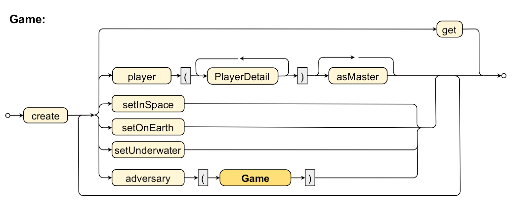

# Lab Unit "Fluent Interfaces"

The purpose of this lab is to develop an API implementing a "domain specific language" (DSL) for a hypothetical game that is to be set up using Java code.
This game needs player objects, master-player details, and location information that will be "collected" via a DSL before creating a `Game` object.

This repository contains the sourcecode to the four different grammar levels: **Basic**, **Nested**, **RandomOrder**, and **Recursive**.

Each solution is accessible here as a dedicated commit with a *Tag* label representing the grammar level. Use the dropdown above to switch from *master* commit the the corresponding *Tags/commits*.

# "Recursive" Grammar

The last change to our grammar now allows for recursive adding of `Game` objects to the current `Game` object. (`Game`s are now supposed to be played against other `Game`s.)


## Grammar diagram



## Code snippet

````java
import game.Game;
import static game.Game.*;

// ...

Game g = Game.create()
             .player( name("Brent"), age(27), level(3) )
             .player( name("Sue"), level(10) )
             .setOnEarth()
             .player( name("Mary") ).asMaster()
             .player( )
             .adversary(Game.create()
                            .player( name("Capt. Kirk"), age(99))
                            .setInSpace()
                            .player( name("Kahn") )
                            .adversary(Game.create()
                                           .player( level(1000)  )
                                           .get())
                            .get())
             .get();


````
