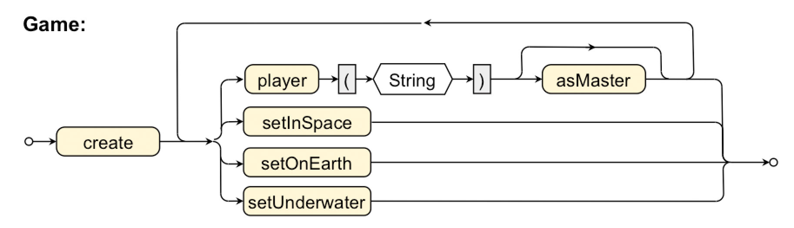

# "Basic" Grammar

The following syntax diagram and sample code snippet are given. 
Implement the needed interfaces and simple implementing classes in order to run the code snippet without compiler 
(and later runtime) errors. 

## Grammar diagram



## Code snippet

````java


// ...

Game g = Game.create()
             .player("Tom")
             .player("Annie")
             .asMaster()
             .player("Louise")
             .setInSpace();

````
