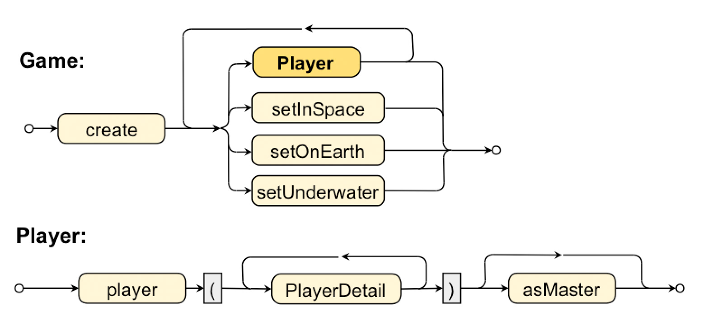

# "Nested" Grammar

`Player`s’ attributes are added in more fluent way - with method nesting.
Using imported static methods we can set specific attributes of `Player`s class.

## Grammar diagram



## Code snippet

````java

import static game.Game.*;

// ...

Game g = Game.create()
             .player( name("Brent"), age(27), level(3) )
              .player( name("Sue"), level(10) )
              .player( name("Mary") ).asMaster()
              .player()
              .setUnderwater();


````
